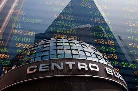

background-image: url(images/intro1.png)
background-position: 20% 10%
class: center, middle

# <span style="color: orange">**Introducción a los mercados financieros**</span>
*---
### <span style="color: white">**Autor: Dr. Oscar V. De la Torre Torres** </span>


```{r echo=FALSE, warning=FALSE, message=FALSE}
library(Quandl)
library(openxlsx)
library(kableExtra)
library(eikonapir)
library(plotly)
library(xtable)
library(DT)
set_app_id('617a3f4d2db44d8f859314f8b45307a9be2d33cd')

```    
---
# <span style="color: orange">Lo que aprenderemos este semestre</span>
*---
<p class="right">

<p>

En este semestre se aprenderá lo que son los valores, cómo se negocían en los principales tipos de mercados financieros, qué tipos son, cuál es su método de valuación y cuáles son las principales estrategias de inversión que se pueden seguir con los mismos.

La materia tienen un enfoque teórico-práctico y tiene 6 grandes temas a revisar:

1. Introducción a los mercados financieros.
2. Mercados de dinero y de deuda.
3. Mercado de capitales.
4. Estrategias de inversión y de portafolios.
5. Mercado de derivados.
6. Mercado de divisas.

---
# <span style="color: orange">Introducción a la materia</span>
*---
Comenzaremos revisando lo que se entiende como valor y los tipos que existen de estos.

## <span style="color: orange">Valores y tipos de mercados de valores</span>

Para comprender lo que es un valor, debemos partir de los términos **activo** y **activo financiero**.

- **un bien**: Un bien es una artículo o servicio que es de nuestra propiedad pero no genera un flujo de beneficios por sí mismo.
-**un activo**: es un bien pero este tipo de bien genera un beneficio o un flujo de beneficios a futuro. Ejemplos de activo son:
  - el equipo de transporte que genera el bien o beneficio de transportar mercancías.
  - el equipo de cómputo que genera flujos de información y datos.
  - un pagaré que genera el beneficio de más flujo de efectivo (intereses).
  - la acción de una empresa que genera el beneficio de ganancias de capital (vía recapitalización de utilidades) o en efectivo (pago de dividendos).
  
---
# <span style="color: orange">Introducción a la materia</span>
*---
## <span style="color: orange">Valores y tipos de mercados de valores</span>

- **un activo financiero**: de los bienes, nos interesan los activos financieros que pagan flujos de dinero. Ya sea vía intereses, dividendos, ganancias de capital o diversos flujos de efectivo. Ejemplos de activos financieros son:
  1. un pagaré que genera el beneficio de más flujo de efectivo (intereses).
  2. un contrato de arrendamiento de un inmueble.
  3. un contrato de un crédito que una empresa o banco otorga.
  4. el factoraje (pago adelantado con descuento de intereses) de una factura.
  5. un Certificado de la Tesorería (**CETE**) emitido por el Gobierno Federal para financiar sus compromisos de corto plazo.
  6. un bono emitido por un gobierno, banco o empresa para financiar sus actividades de mediano y largo plazo.
  7. la **acción de una empresa** que genera el beneficio de ganancias de capital (vía recapitalización de utilidades) o en efectivo (pago de dividendos).
  8. La cobertura (**forward**, **futuro** u **opción**) sobre el precio a futuro del dólar de EEUU respecto al peso mexicano.

---
# <span style="color: orange">Introducción a la materia</span>
*---
## <span style="color: orange">Valores y tipos de mercados de valores</span>

 De los ejemplos anteriores podemos hacer una diferencia importante: unos de ellos (el activo financiero) tienen expresamente (por escrito) especificado de las dos partes involucradas. Esto es, aparece el nombre de quien emite el activo (quien recibe el préstamo o la inversión) y quien lo compra (quien invierte o presta el dinero). 
 
A pesar de lo anterior, hay un tipo de activo financiero en el que el nombre del emisor aparece expresamente (la empresa, gobierno o banco que pide prestado o recibe el capital invertido) pero no aparece el nombre de quien compra. Es decir, es un activo financiero al *portador*.

Ete tipo de activos financieros pueden revenderse libremente en un mercado financiero y se denominan **valores**. Estos últimos son el objeto de estudio de la materia a cursar.
 
- **valor**: Es un activo financiero que puede comprarse y venderse libremente en un mercado financiero.

---
# <span style="color: orange">Introducción a la materia</span>
*---
## <span style="color: orange">Valores y tipos de mercados de valores</span>

De los ejemplos previamente citados en la [diapositiva 3](#3),los activos financieros 5 a 8 son ejemplos de **valores**. Los otros, como se dijo en esa diapositiva, son meros activos financieros que no pueden revenderse una vez comprados:

  5. un Certificado de la Tesorería (**CETE**) emitido por el Gobierno Federal para financiar sus compromisos de corto plazo.
  6. un bono emitido por un gobierno, banco o empresa para financiar sus actividades de mediano y largo plazo.
  7. la **acción de una empresa** que genera el beneficio de ganancias de capital (vía recapitalización de utilidades) o en efectivo (pago de dividendos).
  8. La cobertura (**forward**, **futuro** u **opción**) sobre el precio a futuro del dólar de EEUU respecto al peso mexicano.
  
A pesar de esto, existen múltiples y una infinidad de valores tanto en los mercados financieros mexicanos como los de otros paises y los interbancarios globales. Vamos los mismos a continuación.
  
---
## <span style="color: orange">Valores y tipos de mercados de valores</span>
*---
### <span style="color: orange">Tipos de valores</span>

La clasificación de los mercados de valores puede darse ya sea en función del lugar que ocupa en el balance general del emisor o el tipo de acción que se realiza al invertir en el valor. Veamos la tabla de en [la siguiente diapositiva](#8).

En la misma se aprecia que **los valores del mercado de dinero y del mercado de deuda** son documentos que un gobierno, empresa o banco emite con la finalidad de *endeudarse y pedir prestado* para realizar sus actividades. Por ello, este tipo de valores se contabilizan en el **pasivo del emisor**.

De manera análoga los valores del mercado de capitales son acciones o documentos mercantiles similares en los que la o el inversionista compra una parte de la empresa. Esto es, compra **parte de su capital**. Por eso, este tipo de valores se contabiliza en el capital del emisor.

Un **instrumento derivado o instrumento de cobertura** lo adquiere la o el inversionista con la finalidad de cubrir la fluctuación futura de un precio o el valor de algo en el futuro. por ejemplo, cubrir el precio del trigo en el futuro. Estos son valores que fungen como una especie de seguro en múltiples cosas como tipos de cambio, precios de acciones, tasas de interés, precios de metales, precios de energéticos, niveles de temperatura, precios de bienes agrícolas y demás objetos.

---
### <span style="color: orange">Tipos de valores</span> 

```{r tabla1,echo=FALSE, message=FALSE, warning=FALSE}
tabla1=read.xlsx("Tablas/tabla1.xlsx")
colnames(tabla1)=c("Tipo de valor","Lugar en el balance del emisor","Lugar en el balance de la o el inversionista","Tipo de acción")
kable(tabla1,caption="Tipos de valores dado el tipo de inversión y lugar en el balance general del emisor")%>%kable_styling(bootstrap_options = c("striped", "hover"),font_size = 17)%>%row_spec(0,bold=TRUE,background ="orange", color = "white")%>%column_spec(1:ncol(tabla1),width="15cm")
```

---
### <span style="color: orange">Consideraciones a los tipos de valores como activos o pasivos para la o el inversionista</span>
*___

Como se puede apreciar, los tres primeros tipos de valores forman parte del activo de la o el inversionista y su valor mínimo puede ser de $0.00. Por tanto, puede decirse que su estos no pueden contabilizarse como parte del pasivo de dicha o dicho inversionista.

- El único caso en que uno de estos activos puede convertirse en un pasivo, es cuando la o el inversionista realiza una **inversión apalancada**. Esto es, que invierte todo su dinero y pide otro monto adicional prestado. Si el valor de toda su inversión (dinero propio + dinero prestado) se perdiera todo, la o el inversionista perdera todo su dinero más el dinero prestado. por tanto, el monto del préstamo en una inversión en estos 3 tipos de valores se convierte en un pasivo.

- Los valores o instrumentos derivados pueden convertirse en un pasivo si las condiciones del mercado son demasiado adversas y el diseño de dicho derivado permita pérdidas mayores al 100% en su diseño.

La última afirmación se verá en el tema correspondiente (tema 5 de instrumentos financieros derivados).

---
### <span style="color: orange">Tipos de mercados financieros</span>
#### <span style="color: orange">Mercados financieros por tipo de valor negociado</span>
*___

Los mercados financieros pueden clasificarse desde múltiples perspectivas. De momento solo nos interesan 3 de ellas:

1. Por el tipo de valor que se negocía en los mismos.
2. Por el tipo de instalación y/o organización del mercado.
3. Clasificación de mercado por el momento de colocación.

Veamos el primer tipo de clasificación:
  1. Mercado de dinero: En los mismos se negocian valores de representan deuda de la emisora o (or) y cuyo vencimiento es de corto plazo.
  1. Mercado de deuda: En los mismos se negocian valores de representan deuda de la emisora o (or) y cuyo vencimiento es de de mediano y largo plazo.
  2. Mercado de capitales: En los mismos se negocian valores de representan parte del capital de la emisora o (or).
  3. Mercado de derivados: En los mismos se negocian diversos tipos de instrumentos derivados o de cobertura de precios de diferentes valores, objetos, mercancías (agrícolas, energéticas, metales, etc.), temperaturas o niveles de precipitaciones pluviales.
---
#### <span style="color: orange">Mercados financieros por tipo de instalación y/o organización del mercado</span>
*___


.pull-left[2. Mercado interbancario u OTC (*Over The Counter*): Son mercados que se desarrollan entre instituciones financieras y no tienen ningún tipo de estructura física, leyes o socios específicos.

2. Bolsa de valores: Son mercados establecidos físicamente y tienen socios, reglamentos y leyes específicas que los regulan. Solo las y los intermediarios asociados o registrados en dicha bolsa pueden negociar valores en dichas bolsas.]

.pull-right[
<p class="right">

<p>
<p class="right">

<p>
]

---
#### <span style="color: orange">Mercados financieros OTC o interbancarios</span>
*___

Como se menciona en su definición, estos se forma entre instituciones financieras por medio de contratos de intermediación y todas las operaciones se hacen vía telefónica o por sistemas de comunicación financieros.
<p class="center">

<p> 

Ejemplos de este tipo de mercados, dado el tipo de valor negociado, son:

- Mercado de dinero
- Mercado de deuda
- Mercado de derivados para derivados que no se negocian en bolsas
- Mercado de divisas

---
#### <span style="color: orange">Mercados financieros establecidos o bolsas de valores</span>
*___

Ejemplos de este tipo de mercados, dado el tipo de valor negociado, son:

- Mercado de capitales:
  - [Bolsa Mexicana de Valores](www.bmv.com.mx) (BMV)
  - [Bolsa de Nueva York](www.nyse.com) (*New York Stock Exchange* o NYSE)
  - [NASDAQ](www.nasdaq.com) (*National Association of Security Dealers Automated Quotations*)
  - [Bolsa de Valores de Madrid](www.bolsamadrid.es)
  - [Bolsa de valores de Buenos Aires](www.byma.com.ar)
  - [Bolsa de valores de Ámsterdam](https://www.euronext.com/en/markets/amsterdam) (La más antigua del mundo)
  - [Bolsa de valores de Londres](www.londonstockexchange.com) (*London Stock Exchange* o LSE)
  
- Mercado de derivados estandarizados y negociados en bolsa
  - [Bolsa de Mercancías de Chicago](https://www.cmegroup.com/) (*Chicago Mercantile Exchange* o CME)
  - [Bolsa de Mercancías de Londres](https://www.lme.com/) (*London Mercantile Exchange* o LME)
  - [Mercado Mexicano de Derivados](http://www.mexder.com.mx/) (MEXDER)
  - [Bolsa de opciones de Chicago](https://www.cmegroup.com/) (*Chicago Board of Options Exchange* o CBOE)
  
---
### <span style="color: orange">Tipos de mercados financieros</span>
#### <span style="color: orange">Clasificación de los Mercados financieros por el momento de colocación</span>
*___  

.pull-left[1. **Mercado primario**: En este momento o "tipo de mercado", los inversionistas compran directamente los valores de la emisora o emisor y este último agente (emisora o emisor) recibe el dinero directamente de manos de las y los inversionistas.

2. **Mercado secundario**: Es el mercado en el que las y los inversionistas originales (las y los que participaron en el marcado primario) deciden vender sus valores. Estos se negocian ya entre terceras personas.]

<p class="center">

<p> 

<p class="center">

<p> 

---
### <span style="color: orange">Empresas publicas y empresas privadas</span>
*___  

Para finalizar la introducción a los mercados financieros y su clasificación, hablemos de la distinción entre una empresa pública y una empres privada para fines de la materia.

1. **Empresa Pública**: Es una empresa que ha emitido valores (de deuda o capitales) en uno o varios mercados financieros. Ejemplo de estas son:
  1. Grupo Bimbo que ha emitido deuda en el mercado de deuda mexicano y sus acciones cotizan en la BMV.
  2. BBVA México que ha emitido deuda en el mercado de deuda mexicano.
  3. Microsoft, Facebook o Google, cuyas acciones cotizan en las bolsas NYSE y NASDAQ.
  4. BMW, ADIDAS o Bayer cuyas acciones y deuda emitida cotizan en la bolsa de Frankfurt.
2. **Empresa privada**: Son empresas (de todos los tamaños) que no financian sus actividades acudiendo a emitir valores en algún mercado financiero. Algunos ejemplos de estas son:
  1. Cinépolis.
  2. Farmacias del Ahorro.
  3. Hospitales Ángeles.